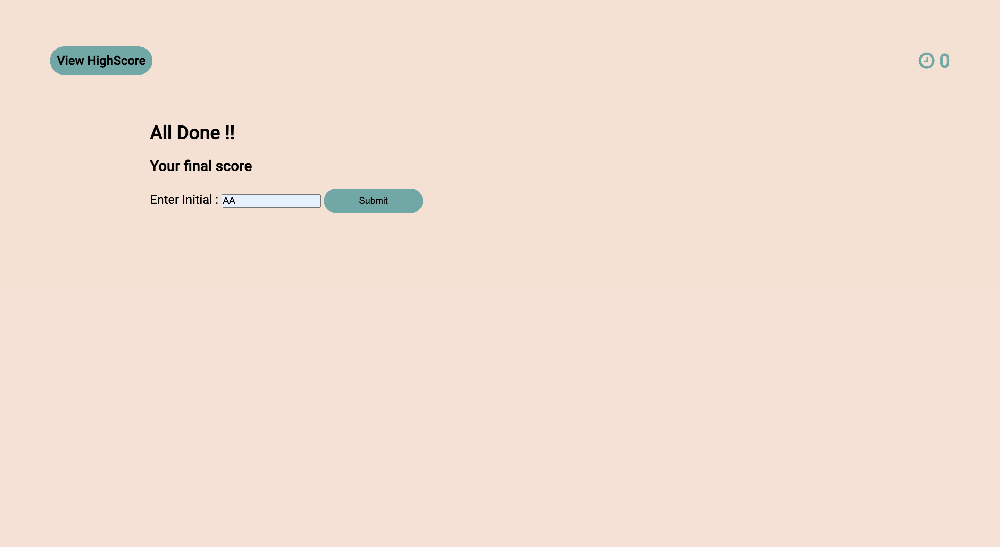

# CODE QUIZ CHALLENGE

## Description

 

This is a code quiz challenge created using HTML5,CSS3 and Javascript. 
Quiz begins when user clicks start Quiz button and is displayed with
a list of questions and answer. 

Once the quiz begins timer(1 minute) starts.
And user can click on the listed choice, are navigated to the next question with 
feedback(Wrong/Correct) on the previous answer.

Once all the questions(5) are answered or timer runs out quiz is over and 
Game over screen is displayed with a form for user to submit their initial.

User score(time left) will saved with initial and will be displayed in another page 
Score can also be accessed from view score link. 
Also back button allows user to navigate back to the quiz page.

And clear score will clear the saved score and display a blank score page.

 

### User Story 

 

AS A coding boot camp student I WANT to take a timed quiz on JavaScript fundamentals  
that stores high scores SO THAT I can gauge my progress compared to my peers

### Acceptance Criteria

 

GIVEN I am taking a code quiz
*   WHEN I click the start button THEN a timer starts and I am presented with a question
*   WHEN I answer a question THEN I am presented with another question
*   WHEN I answer a question incorrectly THEN time is subtracted from the clock
*   WHEN all questions are answered or the timer reaches 0 THEN the game is over
*   WHEN the game is over   THEN I can save my initials and score

## Links

Github Repository link : https://github.com/simmypayyappillyvarghese/coding-quiz-challenge

Live Link: https://simmypayyappillyvarghese.github.io/coding-quiz-challenge/

## Technologies Used
* [x] HTML5
* [x] CSS3
* [x] Javascript

## Screenshot

Below is the quiz Into Page:

Below is the Quiz Section with answer choices

Below is the Feedback Section with answer choices

Below is the Quiz Over Final Page

Below is the Quiz Score page

